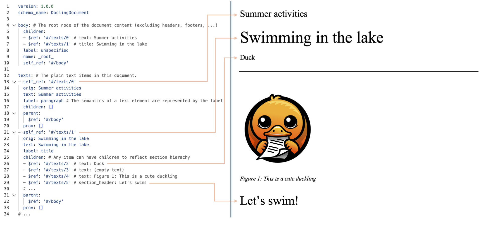
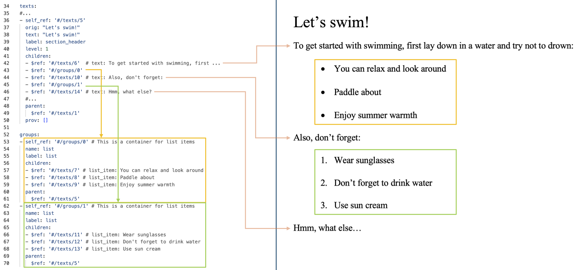

With Docling v2, we introduce a unified document representation format called `DoclingDocument`. It is defined as a
pydantic datatype, which can express several features common to documents, such as:

* Text, Tables, Pictures, and more
* Document hierarchy with sections and groups
* Disambiguation between main body and headers, footers (furniture)
* Layout information (i.e. bounding boxes) for all items, if available
* Provenance information

The definition of the Pydantic types is implemented in the module `docling_core.types.doc`, more details in [source code definitions](https://github.com/DS4SD/docling-core/tree/main/docling_core/types/doc).

It also brings a set of document construction APIs to build up a `DoclingDocument` from scratch.

## Example document structures

To illustrate the features of the `DoclingDocument` format, in the subsections below we consider the
`DoclingDocument` converted from `tests/data/word_sample.docx` and we present some side-by-side comparisons,
where the left side shows snippets from the converted document
serialized as YAML and the right one shows the corresponding parts of the original MS Word.

### Basic structure

A `DoclingDocument` exposes top-level fields for the document content, organized in two categories.
The first category is the _content items_, which are stored in these fields:

- `texts`: All items that have a text representation (paragraph, section heading, equation, ...). Base class is `TextItem`.
- `tables`: All tables, type `TableItem`. Can carry structure annotations.
- `pictures`: All pictures, type `PictureItem`. Can carry structure annotations.
- `key_value_items`: All key-value items.

All of the above fields are lists and store items inheriting from the `DocItem` type. They can express different
data structures depending on their type, and reference parents and children through JSON pointers.

The second category is _content structure_, which is encapsualted in:

- `body`: The root node of a tree-structure for the main document body
- `furniture`: The root node of a tree-structure for all items that don't belong into the body (headers, footers, ...)
- `groups`: A set of items that don't represent content, but act as containers for other content items (e.g. a list, a chapter)

All of the above fields are only storing `NodeItem` instances, which reference children and parents
through JSON pointers.

The reading order of the document is encapsulated through the `body` tree and the order of _children_ in each item
in the tree.

Below example shows how all items in the first page are nested below the `title` item (`#/texts/1`).

### Grouping

Below example shows how all items under the heading "Let's swim" (`#/texts/5`) are nested as chilrden. The children of
"Let's swim" are both text items and groups, which contain the list elements. The group items are stored in the
top-level `groups` field.

<!--
### Tables

TBD

### Pictures

TBD

### Provenance

TBD
 -->
